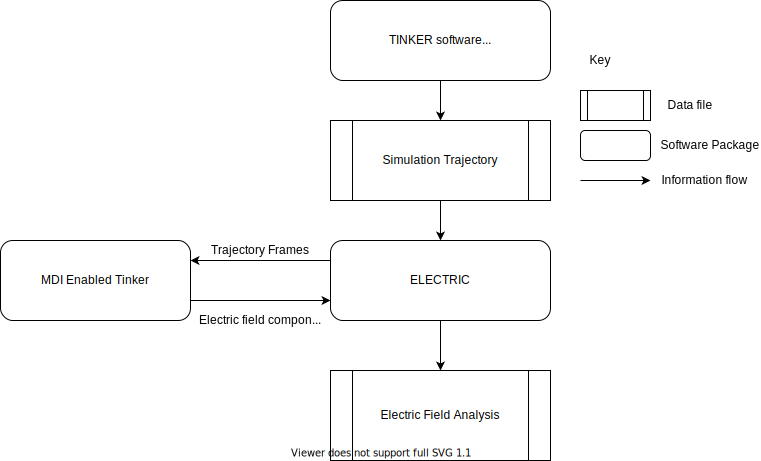

Usage
=====

Information Flow
----------------

ELECTRIC is a post-processing tool for simulations running with the AMOEBA polarizable force field using the Tinker software package.

Procedure
---------

In general, running a calculation with the driver requires the following steps:

1. **Run a dynamics simulation with Tinker.**  
This simulation should be run with periodic boundary conditions (if desired), and should print snapshots of its results to a single file (i.e., `coordinates.arc`).
If each snapshot was instead written to a different file (i.e., `coordinates.001`, `coordinates.002`, etc.) then you may concatenate them into a single file.

2. **Create a new Tinker keyfile.**   
This keyfile should be identical to the one used in Step 1, except that it **must not** include periodic boundary conditions and **must not** use an Ewald summation. This means that in the `.key` file for running the driver, you should not have an `a-axis` keyword, or keywords related to Ewald.

3. **Launch one (or more; see the `-nengines` option below) instance(s) of Tinker as an MDI engine, using the keyfile created in Step 2.**  
This is done in the same way you launch a normal Tinker simulation (by launching the `dynamic.x` executable) except that the `-mdi` command-line option is added. However, it is **very important** that the reference coordinates you use do not have periodic boundary information. So, if when you originally ran the simulation you started it with a snapshot from a previous simulation run, make sure to create a new snapshot to launch the simulation from which does not include box information on line 2.

The argument to the `-mdi` command-line option details how Tinker should connect to the driver; its possible arguments are described in the `MDI documentation`_ .
When in doubt, we recommend doing `-mdi "-role ENGINE -name NO_EWALD -method TCP -port 8021 -hostname localhost"`
When run as an engine, Tinker should be launched in the background; this is done by adding an ampersand (`&`) at the end of the launch line.

4. **Launch the driver**
The driver accepts a variety of command-line options, which are described in detail below.
One possible launch command would be:

.. code-block:: bash

    `python ${DRIVER_LOC} -probes "1 2 10" -snap coordinates.arc -mdi "-role DRIVER -name driver -method TCP -port 8021" --byres ke15.pdb --equil 51 -nengines 15 &`

where `DRIVER_LOC` is the path to ELECTRIC.py which you set during the configuration step.
The output will be written to `proj_totfield.csv`.

It is useful to write a script that performs Steps 3 and 4, especially if the calculations are intended to be run on a shared cluster.
Such a script might look like:

.. code-block:: bash

    # location of required codes
    DRIVER_LOC=$(cat ../locations/ELECTRIC)
    TINKER_LOC=$(cat ../locations/Tinker_ELECTRIC)

    # number of instances of Tinker to run as an engine
    nengines=18

    # set the number of threads used by each code
    export OMP_NUM_THREADS=1

    # launch Tinker as an engine
    for i in $( eval echo {1..$nengines} )
    do
    ${TINKER_LOC} coordinates.in -k no_ewald.key -mdi "-role ENGINE -name NO_EWALD -method TCP -port 8021 -hostname localhost" 10 1.0 1.0 2 300 > no_ewald${i}.log &
    done

    # launch the driver
    python ${DRIVER_LOC} -probes "32 33 59 60" -snap coordinates.arc -mdi "-role DRIVER -name driver -method TCP -port 8021" --byres ke15.pdb --equil 51 -nengines ${nengines} &

    wait

You can read more below, or you can try out the tutorial_ to run a calculation yourself.

Command-Line Options
--------------------

You can see command line arguments for this driver using the following command from the top level of this repositry:

.. code-block:: bash

    python ELECTRIC/ELECTRIC.py --help

Here is the help information for the command line arguments:

.. code-block:: text

    usage: ELECTRIC.py [-h] -mdi MDI -snap SNAP -probes PROBES
                              [-nengines NENGINES] [--equil EQUIL]
                              [--stride STRIDE] [--byres BYRES] [--bymol]

    required arguments:
      -mdi MDI            flags for mdi (default: None)
      -snap SNAP          The file name of the trajectory to analyze. (default:
                          None)
      -probes PROBES      Atom indices which are probes for the electric field
                          calculations. For example, if you would like to
                          calculate the electric field along the bond between
                          atoms 1 and 2, you would use -probes "1 2". (default:
                          None)

    optional arguments:
      -h, --help          show this help message and exit
      -nengines NENGINES  This option allows the driver to farm tasks out to
                          multiple Tinker engines simultaneously, enabling
                          parallelization of the electric field analysis
                          computation. The argument to this option **must** be
                          equal to the number of Tinker engines that are launched
                          along with the driver. (default: 1)
      --equil EQUIL       The number of frames to skip performing analysis on at
                          the beginning of the trajectory file (given by the -snap
                          argument) For example, using --equil 50 will result in
                          the first 50 frames of the trajectory being skipped.
                          (default: 0)
      --stride STRIDE     The number of frames to skip between analysis
                          calculations. For example, using --stride 2 would result
                          in analysis of every other frame in the trajectory.
                          (default: 1)
      --byres BYRES       Flag which indicates electric field at the probe atoms
                          should be calculated with electric field contributions
                          given per residue. If --byres is indicated, the argument
                          should be followed by the filename for a pdb file which
                          gives residues. (default: None)
      --bymol             Flag which indicates electric field at the probe atoms
                          should be calculated with electric field contributions
                          given per molecule. (default: False)

Output
------

The driver will output a file called `proj_totfield.csv`. This is a CSV file which contains data on the projected electric field at the point between each probe atom due to each fragment , depending on input (`--byres` for by residue, `--bymol` for by molecule, or by atom if neither argument is given.). Each column will contain a header which indicates which probe atoms the measurement is between, followed by the frame number, while the rows will be the electric field at the mean location between the probe atoms due to a particular fragment

Consider the example (`bench5`), which was run with the following command:

    python ${DRIVER_LOC} -probes "1 40" -snap bench5.arc -mdi "-role DRIVER -name driver -method TCP -port 8022" --bymol

Here, we have set the probe atoms to be atoms 1 and 40, and we have indicated we want the the electric field between the probe atoms based on contributions by molecule. Headers will be "`i and j - frame n`. Where `i` and `j` are the atom indices of the probes, and `n` is the frame number.

For the example, headers are:

    "1 and 40 - frame 0"
    "1 and 40 - frame 1"
    "1 and 40 - frame 2"
    "1 and 40 - frame 3"
    "1 and 40 - frame 4"

Since this calculation was run using `--bymol`, there are 216 rows, one for each molecule in the system.

The first entry, column `1 and 40 - frame 0`, header `molecule 1`, gives the projected total electric field at the midway point between `atom 1` and `atom 40` due to `molecule 1`. The electric field has been projected along the vector which points from `atom 1` to `atom 40`. The projection will always be along the vector from atom 1 to atom 2. You can reverse the sign of the number if you would like the vector to point the opposite way.

.. _tutorial: tutorial.html
.. _`MDI documentation`: https://molssi.github.io/MDI_Library/html/library_page.html#library_launching_sec